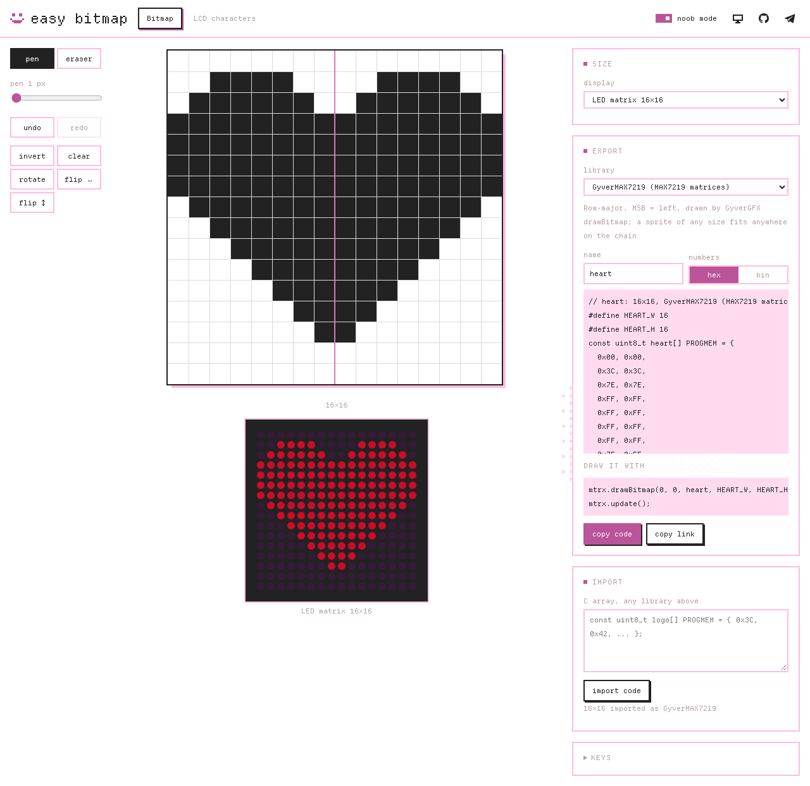

<div align="center">

# easy bitmap

**Draw 1-bit pictures in the browser and paste them into an Arduino sketch as C arrays, byte-exact for the library that draws them**

[](https://github.com/rokokol/easy-bitmap/actions/workflows/build.yml)
[](https://github.com/rokokol/easy-bitmap/actions/workflows/vendor-sync.yml)
[](https://github.com/rokokol/ddlc-palette)
[](ASSETS.md)
[](WORKAROUNDS.md)
[](DEVIATIONS.md)
[](LICENSE)

**[bitmap.rokokol.art](https://bitmap.rokokol.art)**



</div>

Libraries disagree about what a bitmap is. GyverOLED reads vertical bytes, U8g2 reads rows with the left pixel in the lowest bit, Adafruit GFX reads rows with it in the highest, MD_MAX72xx wants a writable array in RAM. A picture exported for the wrong one comes out scrambled on the screen. Here you pick the library, and the array, its declaration and the call that draws it come out in the shape that library reads

## What it does

- **Any rectangle**, or a preset for a common display or matrix, and a small sprite for a corner of a larger screen
- **Export per library**, with `PROGMEM` where the library reads flash, size constants and the line that draws it, in hex or binary
- **LCD characters**, a mode of its own for HD44780 displays (16×2, 16×4, 20×4): eight 5×8 slots, exported with the `createChar` loop
- **Noob mode**, on by default: 8×8 and 16×16 LED matrices, pen and eraser, nothing else
- **Import** a C array from any of the libraries below, or an image with fit, tone and dithering controls
- **Tools**: pen, eraser, line, rectangle, fill, rotate, flip, invert, shift, undo for every step
- **A preview** of the picture on the display it is meant for
- **A link** that holds the whole picture, and the last picture kept in the browser
- Light and dark themes, or the system's

## Libraries

The last column names the library that draws the preset in CI, built for the host from its own source; each pixel it lights is compared with the picture that was exported. A dash marks a raw layout, which no library owns, and the two exceptions to real source are in [WORKAROUNDS.md](WORKAROUNDS.md) and [DEVIATIONS.md](DEVIATIONS.md)

<!-- presets:start -->
| Preset | Kind | Bytes | Drawn in CI by |
| --- | --- | --- | --- |
| GyverMAX7219 (MAX7219 matrices) | LED matrix | rows, MSB = left | GyverMAX7219 |
| LedControl (MAX7219 matrices) | LED matrix | rows, MSB = left | LedControl |
| MD_MAX72xx (MAX7219 modules in a row) | LED matrix | vertical pages, bit 0 = top | MD_MAX72xx |
| microLED (WS2812 matrices) | LED matrix | one colour per pixel | microLED |
| FastLED (WS2812 matrices) | LED matrix | rows, MSB = left | FastLED (EpoxyDuino mock) |
| Adafruit NeoMatrix (WS2812 matrices) | LED matrix | rows, MSB = left | Adafruit GFX |
| Adafruit LED Backpack (HT16K33) | LED matrix | rows, MSB = left | Adafruit LED Backpack |
| GyverOLED (SSD1306, SH1106) | Display | vertical pages, bit 0 = top | GyverOLED |
| GyverGFX (any Gyver display) | Display | rows, MSB = left | GyverGFX |
| Adafruit GFX drawBitmap (SSD1306, ST7735, ...) | Display | rows, MSB = left | Adafruit GFX |
| Adafruit GFX drawXBitmap | Display | rows, LSB = left (XBM) | Adafruit GFX |
| U8g2 drawXBMP | Display | rows, LSB = left (XBM) | U8g2 |
| TFT_eSPI drawBitmap | Display | rows, MSB = left | TFT_eSPI |
| Raw: rows, MSB = left | Raw | rows, MSB = left | — |
| Raw: rows, LSB = left (XBM) | Raw | rows, LSB = left (XBM) | — |
| Raw: vertical pages, bit 0 = top (SSD1306 buffer) | Raw | vertical pages, bit 0 = top | — |
| Raw: vertical pages, bit 7 = top | Raw | vertical pages, bit 7 = top | — |
| LCD custom characters (HD44780) | LCD | 8 rows of 5 bits, bit 4 = left | LiquidCrystal, LiquidCrystal_I2C, hd44780 |
<!-- presets:end -->

## Run it locally

The site is static files with no build step; serve the repository root with any web server:

```sh
python3 -m http.server
```

The tests need Node.js; the library check also needs `g++`:

```sh
npm test            # the export, import and editing logic
npm run test:libs   # every preset drawn by its real library
npm ci && npm run test:e2e   # the page in a browser
```
